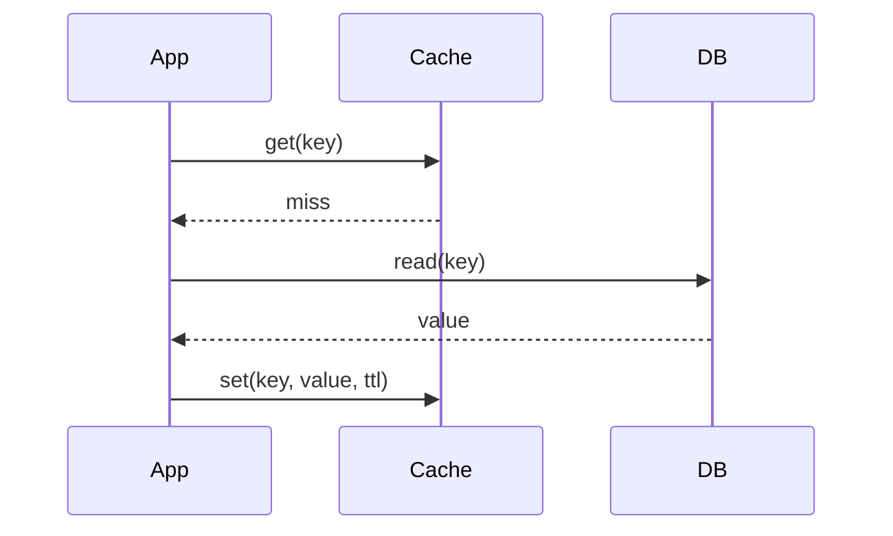

# Caching

## Cache-aside (lazy loading)

The app owns the cache. On a miss it loads from the DB and populates the cache.

## The stampede problem

When a hot key expires, many requests miss **at once** and all hit the DB. Fixes:

- **Single-flight / lock:** only one loader per key; others wait.
- **Staggered TTLs:** add jitter so keys don't expire together.
- **Refresh-ahead:** recompute before expiry.

## Write policies

| Policy | Behaviour |
|--------|-----------|
| write-through | write cache + DB synchronously (consistent, slower) |
| write-back | write cache, flush to DB later (fast, risk of loss) |
| write-around | write DB only; cache fills on read |
