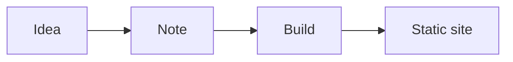

# Welcome to your Notebook

This is your personal, file-based knowledge base — a growing collection of notes
rendered straight from markdown files on disk. Think of it as your own wiki.

## How it works

- Every `.md` file under `content/notes/` becomes a page here.
- **Folders become sections** in the left tree — nest as deep as you like.
- The site is **fully static**: `next build` bakes these files into HTML.

## Two ways to write

1. **Edit the files directly** in your editor (`content/notes/**.md`).
2. **Use the in-app editor** (the ✎ Edit button) while running `npm run dev`
   together with `npm run notes` — it saves back to the file for you.

## Markdown just works

Lists, **bold**, `inline code`, tables, and fenced code blocks all render:

```java
record Point(int x, int y) {}          // concise, immutable
var p = new Point(3, 4);
System.out.println(p);                 // Point[x=3, y=4]
```

| Structure | Lookup | Ordered? |
|-----------|--------|----------|
| HashMap   | O(1)   | no       |
| TreeMap   | O(log n) | yes    |

And diagrams via ```mermaid fences:



> Replace these starter notes with your own — this file lives at
> `content/notes/welcome.md`.
